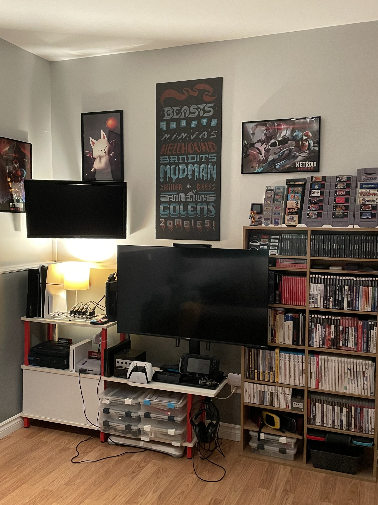

.. _cast:

Cast
====

I also use my retrogaming setup to watch tv shows and movies.

In my Setup I have two Chromecasts:

- a primary "4k Chromecast with Google TV" connected indirectly to my TV through my :ref:`hdmi_switch`;
- a secondary older model Chromecast connected the DELL screen mounted on the wall. It's used for my :ref:`alttpr` setup or to watch a TV show simultaneously as I play a game.

Home Assistant
--------------

In order to be able to watch TV with my setup I had to use Home Assistant to automate the power on of my setup:

- open the TV and select the appropriate TV input using :ref:`cec`;
- select the appropriate input of my :ref:`hdmi_switch` using :ref:`infrared`;
- open the lights;
- activate the :ref:`audio`.

Primary Chromecast's automation
^^^^^^^^^^^^^^^^^^^^^^^^^^^^^^^

I use both `Android TV Remote <https://www.home-assistant.io/integrations/androidtv_remote>`_ and `Google Cast <https://www.home-assistant.io/integrations/cast/>`_ integrations to detect if the Chromecast starts.

I noticed the Android TV Remote integration is more reliable to detect the latest Chromecast's state.

.. code-block:: yaml

    trigger:
      - platform: device
        device_id: 35acec382f488dbacf7b44d83d97a73d
        domain: media_player
        entity_id: media_player.en_bas
        type: turned_on
      - platform: device
        type: turned_on
        device_id: cb31a81713aa4b7233eac40e67b17c5a
        entity_id: remote.en_bas_remote
        domain: remote

Wall mounted monitor's automation
^^^^^^^^^^^^^^^^^^^^^^^^^^^^^^^^^

I use Home Assistant to detect when the Chromecast is playing or buffering and then turn on the corresponding scene.

This scene powers on the :ref:`Smart Plug <smart_plugs>` of the monitor on the wall.

.. code-block:: yaml

    trigger:
      - platform: device
        device_id: 74e61b172c2aafaaa1f753ffed2d8335
        domain: media_player
        entity_id: 86f50f35d5aac8f31f2ba5677bb04b76
        type: buffering
      - platform: device
        device_id: 74e61b172c2aafaaa1f753ffed2d8335
        domain: media_player
        entity_id: 86f50f35d5aac8f31f2ba5677bb04b76
        type: playing

.. _ha_catt_service:

ha-catt-service
^^^^^^^^^^^^^^^

I made the Home Assistant integration `ha-catt-service <https://github.com/jrobichaud/ha-catt-service>`_ to be able to cast an URL to a Chromecast. Its used only by my :ref:`alttpr` setup.

.. code-block:: yaml

    service: catt_service.cast_site
    data:
      device_id: media_player.my_chromecast
      url: https://en.wikipedia.org/wiki/Rickrolling

See the `ha-catt-service's github <https://github.com/jrobichaud/ha-catt-service>`_ for installation and usage.
