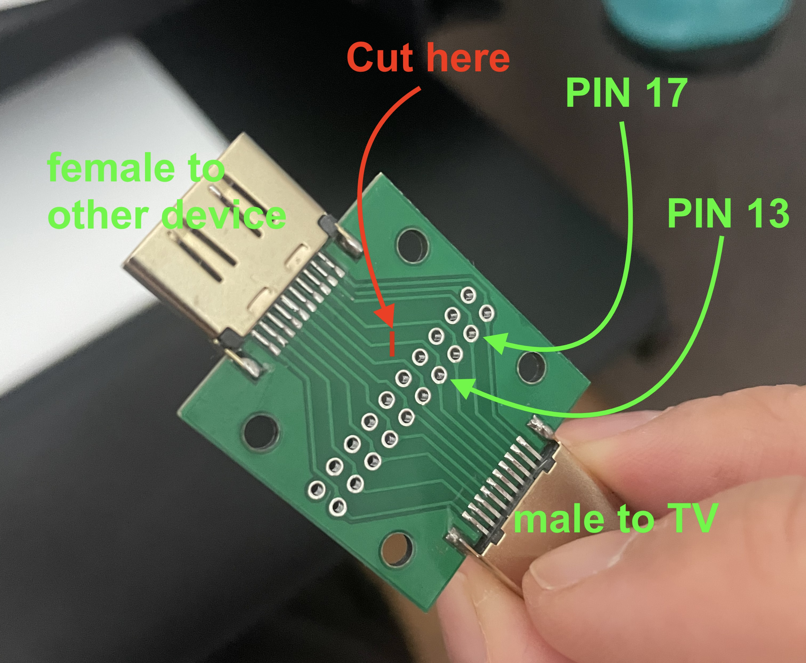

.. _cec:

CEC
===

CEC is a feature of HDMI that allows individual CEC-enabled devices to control each other without user intervention.

Overview
--------

I use CEC protocol control my TV with Home Assistant. Ex: Turn on/off TV, change input source, and control volume.

I first used a Raspberry PI to control the TV but I wanted to move to an ESP32 because the Raspberry pi was not reliable enough (See :ref:`cec_rpi`).

I do not have any spare HDMI ports so I needed to create a CEC proxy between my TV and another device. In my case the Raspberry PI already plugged to my TV. The video and audio still need to pass through.

.. graphviz:: graphs/cec_sequence.dot

.. _esp_home_cec:

ESPHome configuration
---------------------

.. image:: _static/cec/hdmi_cec_home_assistant.png
    :align: center
    :alt: CEC home assistant

I use this `ESPHome external component "Palakis/esphome-native-hdmi-cec" <https://github.com/Palakis/esphome-native-hdmi-cec>`_ to control CEC with Homeassistant through ESPHome.

I used `CEC-O-Matic <https://cec-o-matic.com/>`_ to determine the cec DATA for my TV.

.. csv-table:: CEC messages for my TV
   :file: tables/cec_messages.csv
   :header-rows: 1

With this configuration:

.. code-block:: yaml

    substitutions:
      name: "esphome-retro-cec"
      friendly_name: ESPHome Retro CEC

    esphome:
      name: ${name}
      friendly_name: ${friendly_name}
      name_add_mac_suffix: false
      platformio_options:
        board_build.flash_mode: dio
      project:
        name: esphome.web
        version: '1.0'

    esp32:
      board: esp32-s3-devkitc-1
      framework:
        type: esp-idf

    # Enable logging
    logger:

    # Enable Home Assistant API
    api:
      encryption:
        key: !secret esphome_encryption_key

    # Allow Over-The-Air updates
    ota:
      platform: esphome

    # Allow provisioning Wi-Fi via serial
    improv_serial:

    wifi:
      # Set up a wifi access point
      ap: {}

    # In combination with the `ap` this allows the user
    # to provision wifi credentials to the device via WiFi AP.
    captive_portal:

    dashboard_import:
      package_import_url: github://esphome/firmware/esphome-web/esp32s3.yaml@v2
      import_full_config: true

    # Sets up Bluetooth LE (Only on ESP32) to allow the user
    # to provision wifi credentials to the device.
    esp32_improv:
      authorizer: none

    # To have a "next url" for improv serial
    #web_server: !remove

    external_components:
      - source: github://Palakis/esphome-hdmi-cec

    hdmi_cec:
      address: 0x01 # Recorder
      physical_address: 0x3000
      pin: GPIO4
      osd_name: "retro-cec"

    button:
      - platform: template
        name: TV Volume Up
        on_press:
          - hdmi_cec.send:
              destination: 0x0
              data: [0x44, 0x41]

      - platform: template
        name: TV Volume Down
        on_press:
          - hdmi_cec.send:
              destination: 0x0
              data: [0x44, 0x42]

      - platform: template
        name: Activate TV
        on_press:
          - hdmi_cec.send:
              destination: 0x0
              data: [0x04]

      - platform: template
        name: Standby TV
        on_press:
          - hdmi_cec.send:
              destination: 0x0
              data: [0x36]

      - platform: template
        name: Select Input 1 (hdmi switch)
        on_press:
          - hdmi_cec.send:
              destination: 0xF
              data: [0x82, 0x10, 0x0]

      - platform: template
        name: Select Input 2 (Retrotink4k)
        on_press:
          - hdmi_cec.send:
              destination: 0xF
              data: [0x82, 0x20, 0x0]

      - platform: template
        name: Select Input 3 (pi0)
        on_press:
          - hdmi_cec.send:
              destination: 0xF
              data: [0x82, 0x30, 0x0]

Prototype
---------

I first made a prototype using :ref:`esp32-s3 <arduino_nano-esp32>` with an :ref:`HDMI proto board <hdmi_proto_board>`.

- Pin 13 goes to GPIO4 on this ESP32 board (configurable).
- Pin 17 goes to the ground on the ESP32 board.
- PIN 18 goes to the 5V on the ESP32 board. Needed for the TV to detect the device.

.. image:: _static/cec/hdmi_proto.jpg
    :align: center
    :alt: cec prototype

This proof of concept was working but it was not a man in the middle CEC adapter like I needed.

Real board
----------

I use this useful `female to male HDMI board <hdmi_cec_adapter>`_ to plug inbetween my Raspberry PI and my TV.

We can solder wires on any of the pins which is perfect for my needs.

.. image:: _static/cec/hdmi_board.jpg
    :align: center
    :alt: front cec board

I cut the trace of pin 13 on the side of the Raspberry PI to avoid conflicts.

I then soldered a wire from pin 13 to GPIO04 and a wire from the pin 17 to the ground of the ESP32 board I used from the prototype (probably overkill).

I did not need to solder the 5V pin because the Raspberry PI is already providing the power.

I then used shrink tube to bind the two boards together.
