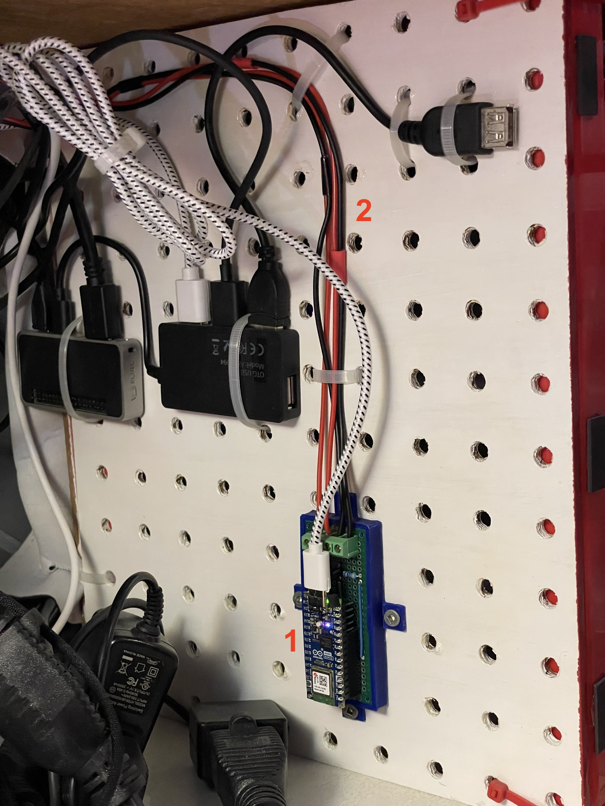

.. _infrared:

Infrared
========

Overview
--------

I use Infrared signals to:

- change profile of the :ref:`Retrotink4K <retrotink_4k>`
- change the input of the :ref:`HDMI switch <hdmi_switch>`

This is how the whole process looks like:

.. graphviz:: graphs/infrared_sequence.dot

This is how the whole setup looks like:

  This image:
  1. `Arduino Nano ESP32-S3 <arduino_nano-esp32>`_ with board. -- 2. There's one cable going to the Retrotink4K and another one going to the HDMI switch.

Note: The reason I used this an ``Arduino Nano ESP32-S3`` over a simpler model is because my :ref:`cec_rpi` used an ``Arduino Nano Every`` with identical pinout. I could just swap the board and keep the same wiring.

.. figure:: _static/keypad.jpg
   :alt: Keypad
   :align: center

   This image: an IR LED just above the keypad pointing at the Retrotink4K.

Circuit
^^^^^^^

I followed `adafruit's "sending ir codes" tutorial <https://learn.adafruit.com/using-an-infrared-library/sending-ir-codes>`_ to build the circuit.

I used these :ref:`ir_leds`.

ESP Home configuration
----------------------

I use ESPHome to control the IR LEDs from Home Assistant (`"remote_transmitter.transmit_nec" documentation <https://esphome.io/components/remote_transmitter.html#remote-transmitter-transmit-nec-action>`_).

I originally captured the IR code myself but all the codes are here: `RetroTINK IR Remote Codes <https://consolemods.org/wiki/AV:RetroTINK-4K#Remote>`_

.. code-block:: yaml

    substitutions:
      name: "esphome-retro-ir-nano"
      friendly_name: ESPHome Retro IR Nano

    esphome:
      name: ${name}
      friendly_name: ${friendly_name}
      name_add_mac_suffix: false
      platformio_options:
        board_build.flash_mode: dio
      project:
        name: esphome.web
        version: '1.0'

    esp32:
      board: esp32-s3-devkitc-1
      framework:
        #type: arduino
        type: esp-idf

    # Enable logging
    logger:

    # Enable Home Assistant API
    api:
      encryption:
        key: !secret esphome_encryption_key

    # Allow Over-The-Air updates
    ota:
      platform: esphome

    # Allow provisioning Wi-Fi via serial
    improv_serial:

    wifi:
      # Set up a wifi access point
      ap: {}

    # In combination with the `ap` this allows the user
    # to provision wifi credentials to the device via WiFi AP.
    captive_portal:

    dashboard_import:
      package_import_url: github://esphome/firmware/esphome-web/esp32s3.yaml@v2
      import_full_config: true

    # Sets up Bluetooth LE (Only on ESP32) to allow the user
    # to provision wifi credentials to the device.
    esp32_improv:
      authorizer: none

    # To have a "next url" for improv serial
    #web_server:

    remote_transmitter:
      pin:
        number: GPIO06
      carrier_duty_percent: 50%

    button:
      - platform: template
        name: Switch HDMI_1
        on_press:
          - remote_transmitter.transmit_nec:
              address: 0x1
              command: 0xE41B

      - platform: template
        name: Switch HDMI_2
        on_press:
          - remote_transmitter.transmit_nec:
              address: 0x1
              command: 0xE11E

      - platform: template
        name: Switch HDMI_3
        on_press:
          - remote_transmitter.transmit_nec:
              address: 0x1
              command: 0xF20D

      - platform: template
        name: Switch HDMI_4
        on_press:
          - remote_transmitter.transmit_nec:
              address: 0x1
              command: 0xED12

      - platform: template
        name: Switch HDMI_5
        on_press:
          - remote_transmitter.transmit_nec:
              address: 0x1
              command: 0xEF10

      # https://consolemods.org/wiki/AV:RetroTINK-4K#Remote
      - platform: template
        name: RetroTINK 4k Profile 1
        on_press:
          - remote_transmitter.transmit_nec:
              address: 0xB649
              command: 0xF40B
              repeat:
                times: 2
                wait_time: 100ms

      - platform: template
        name: RetroTINK 4k Profile 2
        on_press:
          - remote_transmitter.transmit_nec:
              address: 0xB649
              command: 0xF807
              repeat:
                times: 2
                wait_time: 100ms

      - platform: template
        name: RetroTINK 4k Profile 3
        on_press:
          - remote_transmitter.transmit_nec:
              address: 0xB649
              command: 0xFC03
              repeat:
                times: 2
                wait_time: 100ms

      - platform: template
        name: RetroTINK 4k Profile 4
        on_press:
          - remote_transmitter.transmit_nec:
              address: 0xB649
              command: 0xF50A
              repeat:
                times: 2
                wait_time: 100ms

      - platform: template
        name: RetroTINK 4k Profile 5
        on_press:
          - remote_transmitter.transmit_nec:
              address: 0xB649
              command: 0xF906
              repeat:
                times: 2
                wait_time: 100ms

      - platform: template
        name: RetroTINK 4k Profile 6
        on_press:
          - remote_transmitter.transmit_nec:
              address: 0xB649
              command: 0xFD02
              repeat:
                times: 2
                wait_time: 100ms

      - platform: template
        name: RetroTINK 4k Profile 7
        on_press:
          - remote_transmitter.transmit_nec:
              address: 0xB649
              command: 0xF609
              repeat:
                times: 2
                wait_time: 100ms

      - platform: template
        name: RetroTINK 4k Profile 8
        on_press:
          - remote_transmitter.transmit_nec:
              address: 0xB649
              command: 0xFA05
              repeat:
                times: 2
                wait_time: 100ms

      - platform: template
        name: RetroTINK 4k Profile 9
        on_press:
          - remote_transmitter.transmit_nec:
              address: 0xB649
              command: 0xFE01
              repeat:
                times: 2
                wait_time: 100ms

      - platform: template
        name: RetroTINK 4k Profile 10
        on_press:
          - remote_transmitter.transmit_nec:
              address: 0xB649
              command: 0xDA25
              repeat:
                times: 2
                wait_time: 100ms

      - platform: template
        name: RetroTINK 4k Profile 11
        on_press:
          - remote_transmitter.transmit_nec:
              address: 0xB649
              command: 0xD926
              repeat:
                times: 2
                wait_time: 100ms

      - platform: template
        name: RetroTINK 4k Profile 12
        on_press:
          - remote_transmitter.transmit_nec:
              address: 0xB649
              command: 0xD827
              repeat:
                times: 2
                wait_time: 100ms

Capturing infrared codes (optional)
^^^^^^^^^^^^^^^^^^^^^^^^^^^^^^^^^^^

I used the circuit `described here <https://learn.adafruit.com/using-an-infrared-library/hardware-needed>`_ but I used this old source to capture the codes: `MinimalReceiver.ino <https://raw.githubusercontent.com/Arduino-IRremote/Arduino-IRremote/922d2c5c81c9057b2dbf6b1772c6f3195ec6ef85/examples/MinimalReceiver/MinimalReceiver.ino>`_.
