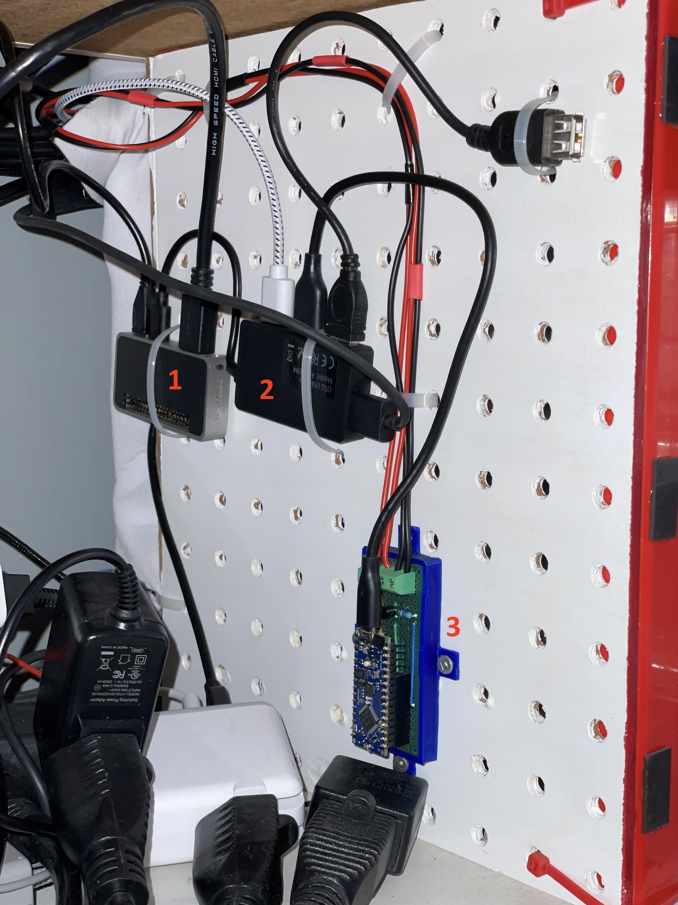

.. _infrared:

Infrared
========

Overview
--------

I use Infrared signals to:

- change profile of the :ref:`Retrotink4K <retrotink_4k>`
- change the input of the :ref:`HDMI switch <hdmi_switch>`

This is how the whole process looks like:

.. graphviz:: infrared_sequence.dot

This is how the whole setup looks like:

  This image:
  1. Raspberry pi Zero 2W -- 2. USB Hub -- 3. Arduino Nano Every with board. There's one cable going to the Retrotink4K and another one going to the HDMI switch.

Home Assistant MQTT
-------------------

Prerequisites
^^^^^^^^^^^^^

Setup :ref:`Home Assistant's MQTT Broker<homeassistant_mqtt>`.

Automation
^^^^^^^^^^

Create an automation to send the nec codes to :ref:`mqtt_to_nec`.

The codes match `mqtt2nec's config.csv <https://github.com/jrobichaud/mqtt2nec/blob/main/config.csv>`_. You can also send codes as hex strings.

The first value is common for the device and the next ones are the actual code you want to send.

.. code-block:: yaml

    service: mqtt.publish
    data:
      topic: nec/tx
      payload: "{\"codes\":  [  \"TINK4K\", \"TINK4K_1\" ]}"

.. _mqtt_to_nec:

mqtt2nec
--------

Python program interfacing Home assistant with the arduino. It is installed on the Raspberry pi and runs as a service.

`sources <https://github.com/jrobichaud/mqtt2nec>`_

Installing the program
^^^^^^^^^^^^^^^^^^^^^^

.. code-block:: bash

    git clone git@github.com:jrobichaud/mqtt2nec.git
    cd mqtt2nec
    python3 -m venv venv
    source venv/bin/activate
    pip install -r requirements.txt

Running the program
^^^^^^^^^^^^^^^^^^^

Make sure to change the arguments to match your mqtt broker configuration.

.. code-block:: bash

    python3 -m "mqtt2nec" "<home assistant url>" -u "<mqtt user>" -p "<mqtt password>" -a "./config.csv"

Service configuration
^^^^^^^^^^^^^^^^^^^^^

.. code-block:: ini

    [Unit]
    Description=mqtt2nec
    Documentation=
    After=network.target

    [Service]
    Type=simple
    User=retro
    ExecStart=/usr/bin/python3 -m "mqtt2nec" "<home assistant url>" -u "<mqtt user>" -p "<mqtt password>" -a "/home/retro/mqtt2nec/config.csv"
    Restart=always
    MemorySwapMax=0

    [Install]
    WantedBy=multi-user.target

Arduino
-------

I used this kit to prototype: `Basic Kit for Arduino <https://www.canakit.com/arduino-starter-kit.html>`_

I use the `Arduino Nano Every <https://store-usa.arduino.cc/products/arduino-nano-every>`_ on my setup.

Circuit
^^^^^^^

I followed `adafruit's "sending ir codes" tutorial <https://learn.adafruit.com/using-an-infrared-library/sending-ir-codes>`_ to build the circuit.

infrared-nec (Arduino program)
^^^^^^^^^^^^^^^^^^^^^^^^^^^^^^

The program to install on the arduino: `infrared-nec <https://github.com/jrobichaud/infrared-nec>`_

This is a custom programming that communicates with the mqtt2nec program. It was heavily inspired by `adafruit's "sending ir codes" tutorial <https://learn.adafruit.com/using-an-infrared-library/sending-ir-codes>`_.

Capturing infrared codes (optional)
^^^^^^^^^^^^^^^^^^^^^^^^^^^^^^^^^^^

I used the circuit `described here <https://learn.adafruit.com/using-an-infrared-library/hardware-needed>`_ but I used this old source to capture the codes: `MinimalReceiver.ino <https://raw.githubusercontent.com/Arduino-IRremote/Arduino-IRremote/922d2c5c81c9057b2dbf6b1772c6f3195ec6ef85/examples/MinimalReceiver/MinimalReceiver.ino>`_.
