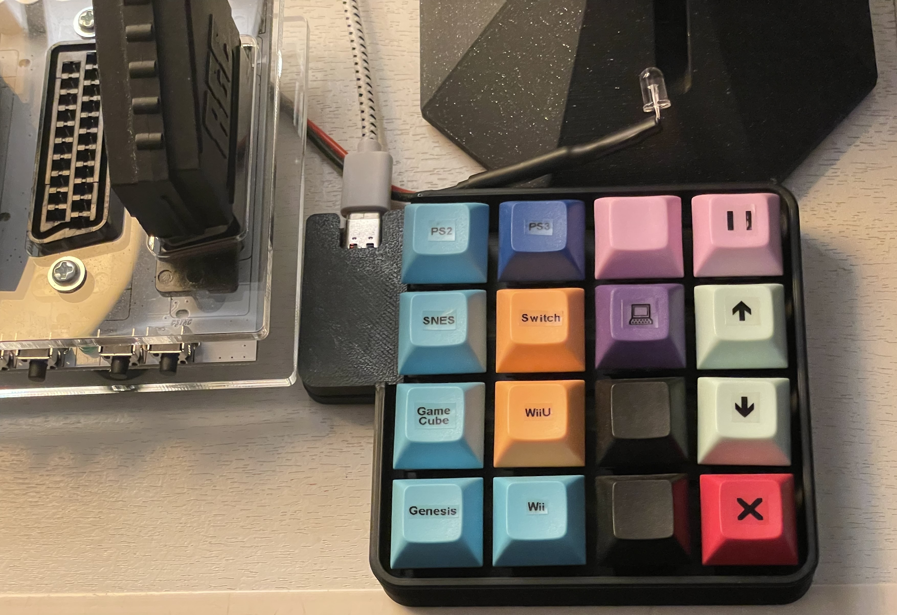

.. _keypad:

Keypad
======

Its a 3d printed keypad with 16 keys I bought from `Etsy <https://www.etsy.com/ca/listing/1031708108/zmk-16-hotswap-mechanical-macropad>`_.

Overview
--------

.. graphviz:: graphs/keypad_sequence.dot

.. _keypad_to_mqtt:

Keypad
------

I mapped the keys from F1 to F16 using `QMK <https://qmk.fm/>`_ or `Vial <https://get.vial.today/>`_... I can't remember which one I used.

I used a P-touch label maker to label the keys.

The keypad is plugged to the raspberry pi.

The red X button will:

- power off all the :ref:`smart_plugs` except the one for the TV I keep always active;
- send :ref:`cec` message to turn off the TV;
- stop the streaming on the :ref:`Chromecasts <cast>`;
- close the light;
- (I still manage the power of my consoles manually, however the PS5 will detect via :ref:`cec` the TV is turned off so it will go to sleep automatically).

keypad2mqtt
-----------

Python program interfacing the keypad with Home Assistant. It is installed on the Raspberry pi and runs as a service.

`sources <https://github.com/jrobichaud/keypad2mqtt>`_

Installing the program
^^^^^^^^^^^^^^^^^^^^^^

.. code-block:: bash

    git clone git@github.com:jrobichaud/keypad2mqtt.git
    cd keypad2mqtt
    python3 -m venv venv
    source venv/bin/activate
    pip install -r requirements.txt

Running the program
^^^^^^^^^^^^^^^^^^^

Make sure to change the arguments to match your mqtt broker configuration.

.. code-block:: bash

    python3 -m "keypad2mqtt" "<homeassistant url>" -d "ZiddyMakes ZMK_16_KEY" -u "<mqtt user>" -p "<mqtt password>"

Service configuration
^^^^^^^^^^^^^^^^^^^^^

.. code-block:: ini

    [Unit]
    Description=keypad2mqtt
    Documentation=
    After=network.target

    [Service]
    Type=simple
    User=retro
    ExecStart=/usr/bin/python3 -m "keypad2mqtt" "<homeassistant url>" -d "ZiddyMakes ZMK_16_KEY" -u "<mqtt user>" -p "<mqtt password>"
    Restart=always
    MemorySwapMax=0

    [Install]
    WantedBy=multi-user.target

Home Assistant configuration
----------------------------

Create an Home Assistant automation for each key using a MQTT trigger for each topic.

.. code-block:: yaml

    trigger:
      - platform: mqtt
        topic: keypad/F1

