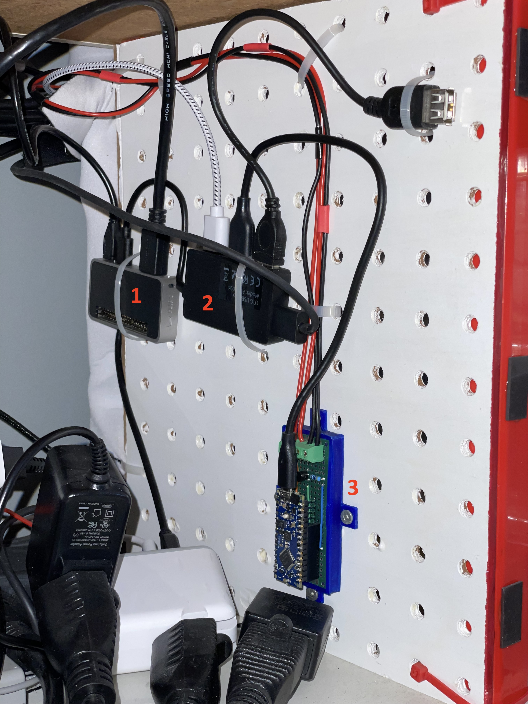

.. _obsoletes:

=========
Graveyard
=========

This file contains a list of previous implementations that have been replaced with newer ones.

.. _cec_rpi:

CEC through Raspberry PI
========================

*I no longer use this method because Home Assistant was regularly losing connection with the Raspberry PI and the only way to resolve it was to restart regularly Homeassistant. See* :ref:`latest CEC implementation <cec>` *.*

CEC is a feature of HDMI that allows individual CEC-enabled devices to control each other without user intervention.

Overview
--------

I use CEC protocol control my TV from Home Assistant. Ex: Turn on/off TV, change input source, and control volume.

.. graphviz:: graphs/obsoletes/cec_sequence.dot

Proxy configuration
-------------------

Setup service
^^^^^^^^^^^^^

Compile/Install `libcec <https://github.com/Pulse-Eight/libcec>`_

Install `pyCEC <https://pypi.org/project/pyCEC/>`_

.. code-block:: bash

    pip3 install pyCEC

Configure a service for pyCEC:

.. code-block:: yaml

    [Unit]
    Description=PyCEC
    Documentation=
    After=network.target

    [Service]
    Type=simple
    User=retro
    ExecStart=/usr/bin/python3 -m pycec
    Restart=always
    #RuntimeMaxSec=1d
    #MemoryHigh=50M
    MemoryMax=60M
    MemorySwapMax=0

    [Install]
    WantedBy=multi-user.target

It appears to have a memory leak and I made sure it kills itself when it gets to 60M of memory.

Home Assistant
--------------

Configuration
^^^^^^^^^^^^^

`Documentation <https://www.home-assistant.io/integrations/hdmi_cec/>`_

create a file ``hdmi_cec.yaml`` and add the hostname/ip of the cec proxy:

.. code-block:: yaml

    host: retro-controller.local # this the hostname of my raspberry pi

in ``configuration.yaml`` add:

.. code-block:: yaml

    hdmi_cec: !include hdmi_cec.yaml

Automations
^^^^^^^^^^^

I used `CEC-O-Matic <https://cec-o-matic.com/>`_ to determine the messages for my TV.

.. csv-table:: CEC messages for my TV
   :file: tables/cec_messages.csv
   :header-rows: 1

This is an example home assistant automation to switch to hdmi 1:

.. code-block:: yaml

    service: hdmi_cec.send_command
    data:
        raw: 1f:82:10:00

Infrared through Arduino
========================

*I no longer use this method because Home Assistant was regularly losing connection with the Raspberry PI and the only way to resolve it was to restart regularly Homeassistant. See* :ref:`latest infrared implementation <infrared>` *.*

Overview
--------

I use Infrared signals to:

- change profile of the :ref:`Retrotink4K <retrotink_4k>`
- change the input of the :ref:`HDMI switch <hdmi_switch>`

This is how the whole process looks like:

.. graphviz:: graphs/obsoletes/infrared_sequence.dot

This is how the whole setup looks like:

  This image:
  1. Raspberry pi Zero 2W -- 2. USB Hub -- 3. Arduino Nano Every with board. There's one cable going to the Retrotink4K and another one going to the HDMI switch.

.. figure:: _static/keypad.jpg
   :alt: Keypad
   :align: center

   This image: an IR Led just above the keypad pointing at the Retrotink4K.

Home Assistant MQTT
-------------------

Prerequisites
^^^^^^^^^^^^^

Setup :ref:`Home Assistant's MQTT Broker<homeassistant_mqtt>`.

Automation
^^^^^^^^^^

Create an automation to send the nec codes to :ref:`mqtt_to_nec_obsolete`.

The codes match `mqtt2nec's config.csv <https://github.com/jrobichaud/mqtt2nec/blob/main/config.csv>`_. You can also send codes as hex strings.

The first value is common for the device and the next ones are the actual code you want to send.

.. code-block:: yaml

    service: mqtt.publish
    data:
      topic: nec/tx
      payload: "{\"codes\":  [  \"TINK4K\", \"TINK4K_1\" ]}"

.. _mqtt_to_nec_obsolete:

mqtt2nec
--------

Python program interfacing Home assistant with the arduino. It is installed on the Raspberry pi and runs as a service.

`sources <https://github.com/jrobichaud/mqtt2nec>`_

Installing the program
^^^^^^^^^^^^^^^^^^^^^^

.. code-block:: bash

    git clone git@github.com:jrobichaud/mqtt2nec.git
    cd mqtt2nec
    python3 -m venv venv
    source venv/bin/activate
    pip install -r requirements.txt

Running the program
^^^^^^^^^^^^^^^^^^^

Make sure to change the arguments to match your mqtt broker configuration.

.. code-block:: bash

    python3 -m "mqtt2nec" "<home assistant url>" -u "<mqtt user>" -p "<mqtt password>" -a "./config.csv"

Service configuration
^^^^^^^^^^^^^^^^^^^^^

.. code-block:: ini

    [Unit]
    Description=mqtt2nec
    Documentation=
    After=network.target

    [Service]
    Type=simple
    User=retro
    ExecStart=/usr/bin/python3 -m "mqtt2nec" "<home assistant url>" -u "<mqtt user>" -p "<mqtt password>" -a "/home/retro/mqtt2nec/config.csv"
    Restart=always
    MemorySwapMax=0

    [Install]
    WantedBy=multi-user.target

Arduino
-------

I used this kit to prototype: `Basic Kit for Arduino <https://www.canakit.com/arduino-starter-kit.html>`_

I use the `Arduino Nano Every <https://store-usa.arduino.cc/products/arduino-nano-every>`_ on my setup.
