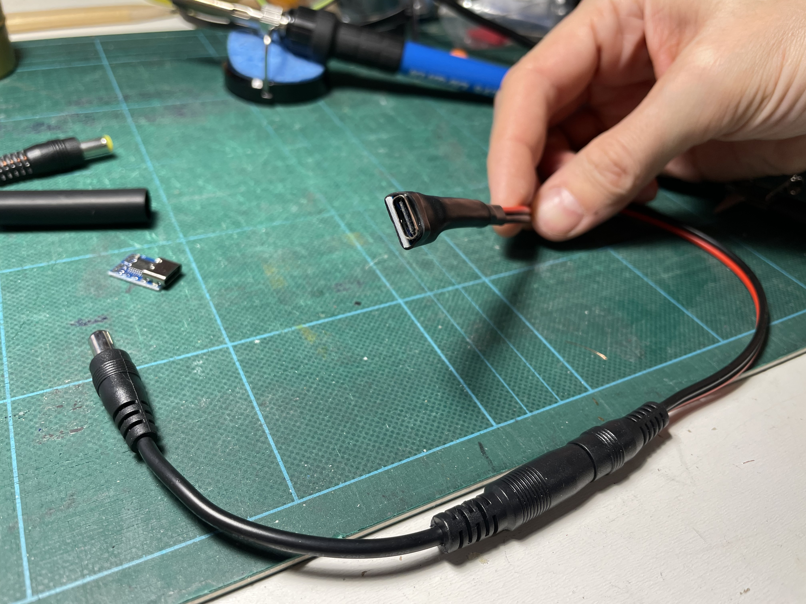

.. _power:

Power
=====

.. _smart_plugs:

Smart Plugs
-----------

In my automations I use smart plugs to power on/off devices using Home Assistant.

Usage of my smart plugs:

- When opening the TV: lights up my LED strip, and activates my :ref:`audio` setup
- When playing retro games: :ref:`anker_elite` powering my :ref:`retrotink_4k`, and my :ref:`hydra`. They both boot on power on.
- When I play PS3: An access point to give it access to the internet
- When I want to play :ref:`alttpr` or cast something while I am playing: It powers on my secondary screen mounted on the wall.
- And when I want to reboot the TV because sometimes CEC stops working.

Sonoff S31
^^^^^^^^^^

I am using the `Sonoff S31 smart plugs  <https://sonoff.tech/product/smart-plugs/s31-s31lite/>`_ to power on/off devices to save power.

They are not expensive, of good quality, and they are easy to flash with :ref:`Tasmota <tasmota>`.

.. _tasmota:

Tasmota
^^^^^^^

`Tasmota is an open-source firmware <https://tasmota.github.io/docs/>`_  for many devices that allows you to control them over MQTT or HTTP.

I followed this guide `awesome guide by Luke Knipe <https://web.archive.org/web/20220925091946/https://lukeknipe.com/s31-tasmota/>`_ that was removed from the internet in 2022 when the author updated his website. I am trying to have the author `to put it back on his website <https://github.com/lukeknipe/lukeknipe.github.io/issues/4>`_.

On chrome: https://tasmota.github.io/install/

USB-C PD
--------

Linus Tech Tips made a video about USB-C PD. It convinced me it was a good way to save space in my setup and have less power consumption when the consoles are not used.

.. image:: https://img.youtube.com/vi/kZOe7aaiqqE/maxresdefault.jpg
    :alt: asad
    :target: https://www.youtube.com/watch?v=kZOe7aaiqqE

Power supplies take a lot of space

.. figure:: _static/pd/saving_space.jpg
    :alt: Power supplies
    :align: center

    This is a picture of everything I removed when I replaced the SNES, Genesis and GameCube power supplies to a single USB-C PD Charger. The Wii and WiiU are even bigger.

Requirements for each of my consoles
^^^^^^^^^^^^^^^^^^^^^^^^^^^^^^^^^^^^

Each console have its own particularities, I had to plan everything properly.

.. csv-table:: Requirements for each of my consoles
    :file: tables/pd.csv
    :header-rows: 1

Making my own cables
^^^^^^^^^^^^^^^^^^^^

    I am holding an :ref:`usb_c_9v_power_trigger` I soldered to a Male barrel jack. Its then plugged to a Male-to-female inverter barrel jack for the SNES' inverted polarity.

Choosing the right power supplies
^^^^^^^^^^^^^^^^^^^^^^^^^^^^^^^^^

.. figure:: _static/pd/65w_psu.jpg
    :alt: 9v with inverter
    :align: center

    This :ref:`65W GAN Charger <ugreen_nexode_65w>` is perfect to plug the WiiU in the first socket, and the Wii in the second socket.

.. figure:: _static/pd/100w_psu.png
    :alt: UGREEN Nexode 100W
    :align: center

    This :ref:`100W GAN Charger <ugreen_nexode_100w>` is perfect to plug the GameCube in the first socket, the Genesis in the second, and SNES in the third socket.
