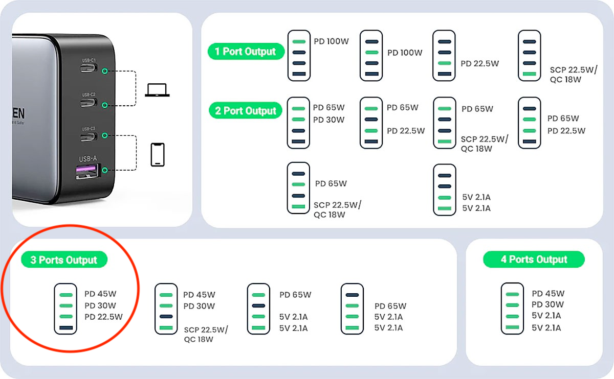

.. _products:

Products Used
=============

This is a list of the products used in the project.

.. _adafruit_usb_c_12v:

Adafruit USB Type C 3.1 PD to 5.5mm Barrel Jack Cable - 12V 5A Output
---------------------------------------------------------------------

`shop <https://www.adafruit.com/product/5450>`_

.. _adafruit_usb_c_15v:

Adafruit USB Type C 3.1 PD to 5.5mm Barrel Jack Cable - 15V 5A Output
---------------------------------------------------------------------

`shop <https://www.adafruit.com/product/5451>`_

.. _anker_elite:

Anker PowerPort 2 Elite
-----------------------

USB charger with 2 ports.

`shop <https://www.anker.com/ca/products/a2023?variant=41698567618724>`_

.. _snes_2_barrel_jack:

Console 5 Super Nintendo SNES Power Supply Adapter Plug Cable
-------------------------------------------------------------

`shop <https://console5.com/store/super-nintendo-snes-power-supply-adapter-plug-cable.html>`_

.. _audio_mixer:

Douk Audio Mixer MX3 (2-CH)
---------------------------

I had a lot of issues with the mixer at first, it had a lot of noise but I figured it out.

1. Only TRS cables must be used. TRRS cables will introduce a lot of noise.
2. The mixer has to be alone on an usb power supply or it will also introduce a lot of noise.

`shop <https://www.amazon.ca/gp/product/B09TKQ11NV/>`_

.. _fxpak_pro:

FXPAK Pro
---------

The flash cart I use for the Super Nintendo. It uses sd2snes.

`on the KRIKZZ.com store <https://krikzz.com/our-products/cartridges/fxpak-pro.html>`_
`on the everdrive.me store <https://everdrive.me/cartridges/fxpak-pro.html>`_

.. _hdmi_switch:

HDMI Switch
-----------

I use the FiveHome 6 Port HDMI 2.0 Switcher I bought from `Amazon CA <https://www.amazon.ca/dp/B076XWNQP9?th=1>`_.

It cannot be controlled via CEC, it has to be controlled with IR or with a physical button.

It appears to be incompatible with the Retrotink 4K.

.. _hydra:

Hydra 2 Revised
---------------

Automatic SCART switch with 8 inputs and 2 output.

`shop <https://lotharek.pl/productdetail.php?id=290>`_

.. _keypad_product:

Keypad
------

See :ref:`keypad`.

.. _ir_leds:

IR Leds
-------

The leds I used are from `Amazon Canada <https://www.amazon.ca/gp/product/B09DK78ZT1/>`_.

.. _barrel_jack_reverse_polarity:

Reverse Polarity Converter Cable
--------------------------------

`Amazon CA <https://www.amazon.ca/dp/B07YJKJY7C/>`_

.. _retrotink_4k:

Retrotink 4K
------------

Upscaler for retro consoles. Upscales video up to 4K.

`shop <https://www.retrotink.com/product-page/retrotink-4k>`_

I bought accessories for it:

- `SCART-Lock for RetroTINK-4K <https://kytor.com/store/product/rt4k-scart-lock/>`_
- `RetroTINK 4K Vertical Stand <https://www.etsy.com/ca/listing/1616574816/retrotink-4k-vertical-stand>`_

.. _soundblaster:

Sound Blaster Recon 3D
----------------------

Discontinued external Sound card with optical input.

`info <https://support.creative.com/Products/ProductDetails.aspx?prodID=20835&prodName=Sound+Blaster+Recon3D>`

.. _ugreen_nexode_65w:

UGREEN Nexode 65W
-----------------

GaN charger with two USB-C PD ports of 45W and 20W.

.. figure:: _static/pd/65w_psu.jpg
    :alt: UGREEN Nexode 65W
    :align: center

`shop <https://www.ugreen.com/products/65w-3-ports-gan-fast-charger?variant=39915659591742>`_

.. _ugreen_nexode_100w:

UGREEN Nexode 100W
-----------------

GaN charger with three USB-C PD ports of 45W and 20W.

`shop <https://www.ugreen.com/products/65w-3-ports-gan-fast-charger?variant=39915659591742>`_

.. _usb_c_9v_power_trigger:

USB-C 9V Power Trigger
----------------------

`Amazon CA <https://www.amazon.ca/gp/product/B09HKJGWKN/>`_
